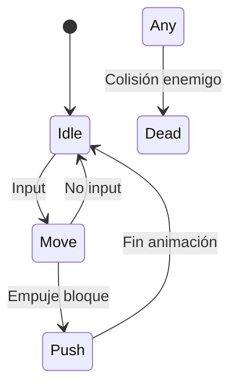
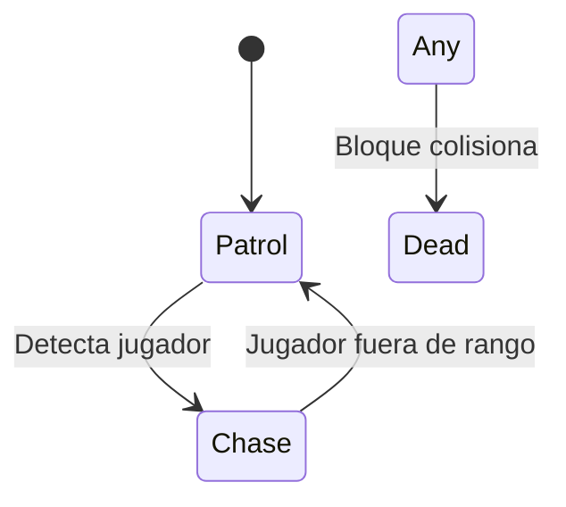

# Definición de Agentes del Juego

## Jugador (Player)

**Atributos:**  
- Posición en grid (x, y)  
- Velocidad (constante, 1 celda/step)  
- Vidas  
- Score acumulado  

**Acciones:** mover, empujar, morir.
- Entrada soportada: acciones `move_*`, `ui_*`, teclas WASD, flechas direccionales y gamepad (D-pad y sticks, deadzone 0.2).

---

## Enemigos (Enemy)

**Tipos:**  
- Random walker  
- Chaser (persecución)  

**Atributos:**  
- Posición en grid  
- Velocidad  
- IA pattern  

**Acciones:** patrullar, perseguir, colisionar con jugador.  

---

## Bloques (Block)
- **Estados:** Static → Sliding → Destroyed  
- **Atributos:** posición en grid, desplazamiento (en tiles)  
- **Acciones:** ser empujado, deslizar, aplastar enemigo  

---

## Power-ups (PowerUp)
- **Tipos:** extra vida, incremento de score, speed-up  
- **Estados:** Idle, Collected  
- **Acciones:** aplicar efecto al jugador  

---

## Sistema de Juego (GameManager)
- Cargar nivel
- Spawnear enemigos
- Controlar condiciones de victoria/derrota
- Registrar y desregistrar enemigos activos según el layout
- Gestionar score global y vidas

---

## HUD
- **Elementos:** score actual, vidas, nivel  
- **Acciones:** actualizar en tiempo real  
