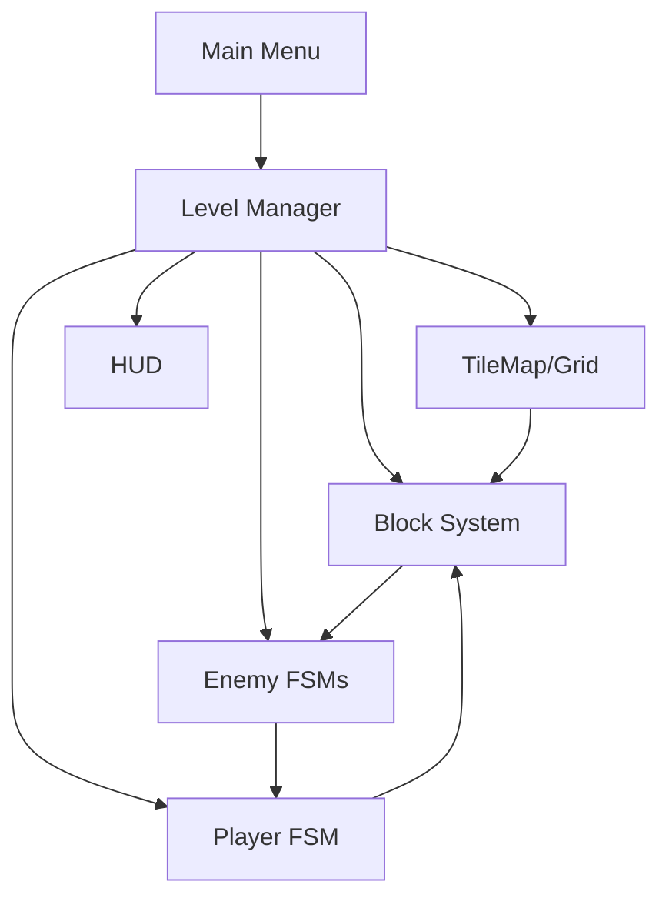

# Arquitectura del Proyecto

## Diagrama General (Mermaid)

---

## Objetivo
Clonar en Godot el juego arcade *Don’t Pull* (Capcom, 1991 dentro de Three Wonders), respetando mecánicas originales y extendible a futuro.

---

## Componentes principales
- **Core Engine (Godot 4.5)**
  - Gestión de escenas y nodos.
  - Render 2D, TileMap, animaciones.
- **Gameplay Layer**
  - Lógica en grid discreto (TileMap).
  - Sistema de colisiones y empuje de bloques.
  - FSM de Jugador y Enemigos.
  - Input Map unificado (`move_*` + `ui_*`) para soportar teclado y gamepad.
  - Utilidades centralizadas en `GameHelpers` (global) para conversión grid ↔ mundo y detección de nodos.
- **UI Layer**
  - HUD: score, vidas, timer.
  - Menú inicial y selección de nivel.
- **Data Layer**
  - Carga de niveles desde JSON/TSV.
  - `LevelLoader` convierte JSON en datos estructurados para la escena `Level`.
  - Configuración de enemigos y power-ups.
- **Assets**
  - Spritesheets (placeholders o extraídos de ROM).
  - Audio SFX/Music (placeholders o libres de derechos).
- **Testing & Debug**
  - Logs de comportamiento (frame stepping).
  - Herramientas de replay simple.

---

## Flujo principal del juego
1. **Init →** carga escena `MainMenu`.
2. **Level Start →** `Level` solicita a `LevelLoader` el layout JSON, usa `GameHelpers` para traducir coordenadas y spawnea jugador, enemigos y bloques.
3. **Gameplay Loop →**
   - Jugador mueve en grid.
   - Empuje de bloques → bloques deslizan hasta colisión.
   - Colisiones con enemigos → muerte o puntuación.
   - Bloques aplastan enemigos durante el deslizamiento y notifican bonus al GameManager.
   - Timer / condiciones de victoria → siguiente nivel.
4. **Game Over / Victory →** HUD muestra resultados, retorna a menú.

---

## Escenas (Godot)
- `/scenes/MainMenu.tscn`
- `/scenes/Level.tscn`
  - TileMap (suelo, muros, bloques).
  - Jugador (Player.tscn).
  - Enemigos (Enemy.tscn).
  - HUD (HUD.tscn).
- `/scenes/Systems`
  - ScoreManager.gd
  - LevelManager.gd
  - InputManager.gd

---

## Tecnologías
- **Lenguaje base:** GDScript (rápido de prototipar).
- **Extensibilidad futura:** posibilidad de migrar a C# módulos de IA/pathfinding.
- **Gestión de niveles:** JSON + TileMap import.
- **Control de versiones:** Git (branch main/dev/feature).
